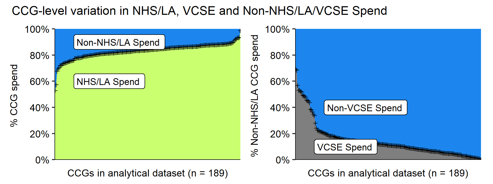

<!--
This is used to add comments and it can span multiple lines.
Here I run the underlying R script as soon as possible to produce figures and tables
This is so I can include information from the R script in the header

-->

## CCG Spend on VCSEs, 2018/19:  Data & Analysis

As part of an NIHR-funded project on *Commissioning, Co-commissioning and Being Commissioned; the NHS and Third Sector Organisations* ([research protocol](https://tinyurl.com/tvpx3ty2)) we obtained, cleaned and analysed Clinical Commissioning Group (CCG) “over-threshold” expenditure data for 2018/19. 

These data were published in response to [HM Treasury’s 2013 guidance](https://tinyurl.com/4m9p23hp) that government bodies should make available, with few exceptions, “all individual invoices, grant payments, expense payments or other such transactions that are over £25,000 . The CCG accounts are part of a now vast array of potentially invaluable expenditure data published in response to the government's transparency agenda.

The project, more conveniently known as the ***3SC (3rd Sector Commissioning) Project***, was particularly concerned with investigating in how CCGs engage with Voluntary, Community and Social Enterprises (VCSEs) in the commissioning of services for three ‘tracer’ care groups; social prescribing for older people, hospices, and people with learning disability and complex behavioural needs.

The ***3SC Project*** used the expenditure data to (a) guide the selection of a ‘maximum-variety’ sample of CCG study sites in terms of their commissioning of VCSEs suppliers, (b) understand in detail the scale and nature of CCG commissioning of VCSEs in the selected study sites, and (c) gain a broader perspective on patterns of VCSE commissioning across the country as a whole.

This ***3SC Project*** *github* repository comprises:
- The ‘raw’ monthly CCG accounts for the 189 (of the then 195) CCGs for which we were able to obtain satisfactory expenditure data ( in the *./data/raw* directory),
- A sequence of cleaned datasets culminating in our “analytical dataset” (*InvoicesExtractDF.csv* & *InvoicesExtractDF.RDS* in the *./data/processed* directory). This contains all individual invoices of £25k and above from across the 189 CCGs (n=225 669) and accounts for ***£70.477 billion*** of CCG expenditure. It also includes details on the suppliers each 'named' supplier obtained through automated and manual searches of Company House and Charity Commission registers, as well as public-facing supplier websites.
- A report detailing (a) how we obtained and cleaned the expenditure data, (b) how suppliers were categorised (including whether or not VCSE), and (c) what the data reveal regarding CCG-level variation in spending on VCSEs in 2018/18 (*./CCG_VCSE_Spend_Report.docx*)
- A series of data-wrangling and analytical R scripts (in the *./Rscripts* directory)
- A series of .csv output files and .png plots created by running the above scripts on the cleaned CCG dataset (in the *./outputs* directory)
- And, to facilitate validation of our analysis and potential further exploitation of te 2018/19 accounts, a single zip file containing all data and R scripts except the 'raw' monthly accounts. If the directory structure is kept when the file is uncompressed, all file pathnames in the R scripts should point to the required data files (in the */data/download* directory).

### Overview of data extraction

