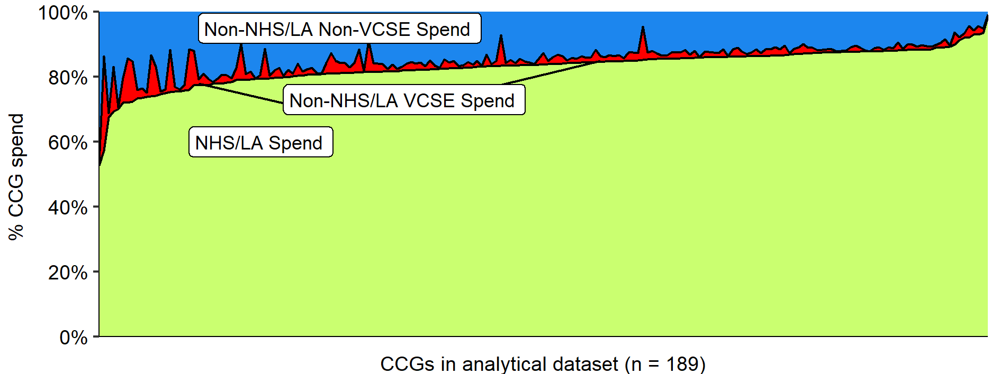

<!--
This is used to add comments and it can span multiple lines.
Here IH:\00_Sheaff New Project\00_FinalReport\3SC run the underlying R script as soon as possible to produce figures and tables
This is so I can include information from the R script in the header

-->
## CCG Spend on VCSEs, 2018/19:  Data & Analysis

As part of an NIHR-funded project on *Commissioning, Co-commissioning and Being Commissioned; the NHS and Third Sector Organisations* ([research protocol](https://tinyurl.com/tvpx3ty2)) a nearly complete set of Clinical Commissioning Group (CCG) “over-threshold” expenditure data for 2018/19 was acquired, cleaned and analysed.  

These data were published in response to [HM Treasury’s 2013 guidance](https://tinyurl.com/4m9p23hp) that government bodies should make available, with few exceptions, “all individual invoices, grant payments, expense payments or other such transactions that are over £25,000 . The CCG accounts are part of a now vast array of potentially invaluable expenditure data published in response to the government's transparency agenda.

The project, more conveniently known as the ***3SC (3rd Sector Commissioning) Project***, was particularly concerned with investigating in how CCGs engage with Voluntary, Community and Social Enterprises (VCSEs) in the commissioning of services for three ‘tracer’ care groups; social prescribing for older people, hospices, and people with learning disability and complex behavioural needs.

The ***3SC Project*** used the expenditure data to (a) guide the selection of a ‘maximum-variety’ sample of CCG study sites in terms of their commissioning of VCSEs suppliers, (b) understand in detail the scale and nature of CCG commissioning of VCSEs in the selected study sites, and (c) gain a broader perspective on patterns of VCSE commissioning across the country as a whole.

This ***3SC Project*** *github* repository comprises:
- The ‘raw’ monthly CCG accounts for the 189 (of the then 195) CCGs for which we were able to obtain satisfactory expenditure data (as CCG-specific zipfiles in the *./data/raw* directory).
- A single collated file containing all data from the above 189 CCG expenditure files, with minor clarification of shared hospice names (*01_CollatedInvoices.RDS* or *01_CollatedInvoices.csv* in the *./data/processed* directory).
- An extract from the collated expenditure datafile of all named suppliers (*01_UniqueSuppliers.csv* in the *./data/processed* directory) and a manually-updated version of that file with details about all suppliers (*01_SuppliersInfo_FINAL.csv* also in the *./data/processed* directory).  As detailed in the accompanying report (*CCG_VCSE_Spend_Report.docx*), this includes information on Charity Commission and Company House registration (where available) along with a classification of each supplier's service sector and VCSE status.
- A single dataset combining the expenditure and supplier datasets (*02_FullCollatedDataset.RDS*). This includes all expenditure records (n=689,536).
- A cleaned dataset of all valid invoices of £25k and above from across the 189 CCGs (*InvoicesExtractDF.csv* or *InvoicesExtractDF.RDS* in the *./data/processed* directory). This constitutes our ***analytical dataset*** and comprises 225,669 records and accounts for ***£70.477 billion*** of CCG expenditure. 
- A report detailing (a) how we obtained and cleaned the expenditure data, (b) how suppliers were categorised (including whether or not VCSE), and (c) what the data reveal regarding CCG-level variation in spending on VCSEs in 2018/18 (*./CCG_VCSE_Spend_Report.docx*)
- A series of data-wrangling and analytical R scripts (in the *./Rscripts* directory) - see below.
- All .csv output files (in the *./data/downloads* directory) created by running the above scripts on the analytical dataset.

### Data Analysis and Outputs

The R scripts are fully commented and should guide any replication and/or subsequent use of the CCG expenditure data for 20187/19.  As detailed in the accompanying report (*./CCG_VCSE_Spend_Report.docx*) it is not now possible to download most of the original accounts from the internet - hence their inclusion in this repository.

Nor is it possible to provide a 'Reproducible Analytical Pipeline' regarding the identification and classification of suppliers. This was based on automated and manual searches of Company House and Charity Commission registers, as well as a huge variety of public-facing supplier websites.

However, all cleaning/manipulation of the expenditure data, culminating in the construction of the 3SC Project's ***analytical dataset*** was undertaken using R, as was the analysis used to inform the accompanying report and generate a variety of summary .csv files describing CCG-level variation in commissioning, including of VCSE suppliers.

***The R scripts and outputs are as follows:***

- ***00_CollateAndCombineCCGData.R***: collates the 189 CCG files into a single file (as *01_CollatedInvoices.RDS* and *01_CollatedInvoices.csv*) and extracts the listing of all supplier names (*01_UniqueSupplierNames.csv*) that was used to search Charity Commission and Company House registers as well as the internet more widely for supplier websites.  It is unlikely that users will find this useful.

- ***01_CleanCCGDataAndExtractAnalyticalDataset.R***: combines the 'invoices' data (*01_CollatedInvoices.RDS*) with what is known about the suppliers (*01_SuppliersInfo_FINAL.csv*), saves the full dataset (*02_FullCollatedDataset.RDS*), and then extracts our ***analytical dataset*** (as *02_InvoicesExtractDF.RDS* and *02_InvoicesExtractDF.csv*). This comprises all 'valid' invoices >= £25k from across the 189 CCGs.  This too is unlikely to be of particular interest.

- ***02_AnalysisForReport.R*** will be of more relevance to most users. Using the full dataset (*02_FullCollatedDataset.RDS*) and, more particularly, the ***analytical dataset*** (*02_InvoicesExtractDF.RDS*), it implements all the analysis, including plot generation, underpinning the accompanying report (*CCG_VCSE_Spend_Report.docx*) and this github README. It also produces the following summary .csv files (in the *../outputs*) directory).

  * **ThresholdSplitByCCG.csv**: For each CCG, the number and proportion of invoices <£25k and >=£25k
  * **SupplierCategorySplitByCCG.csv**: For each CCG, expenditure on suppliers categorised as 'Executor', 'Government', GP Services', 'Hospice', 'Local Authority', 'Local Medical Committee or Local Pharmaceutical Committee', 'NHS', 'Other', 'Pharmacy or Optician', 'Police or Fire Service', 'School', 'Solicitor', 'University'. Plus 'Total' CCG expenditure and each of the foregoing as proportions of total CCG spending.
  * **VCSESuppliers.csv**: A list of all unique suppliers for whom invoices >=£25k appear in the 189 CCGs (n=1,051) with a) number of invoices and b) total value of invoices.
  * **CCGSpendingSplit.csv**: For each CCG, as well as TotalSpend, the spend on NHS and LA suppliers (*NHSLASpend*), on non-NHS/LA suppliers (*NonNHSLASpend*), on non-NHS/LA VCSE suppliers (*NonNHSLAVCSESpend*), and on nonNHS/LA non-VCSE suppliers(*NonNHSLANonVCSESpend*). Then each of these as a proportion of total spend, and finally, VCSE spend as a proportion of non-NHS/LA spending (*VCSEofNonNHSLASpend*) and non-VCSE spend as a proportion of non-NHS/LA spending (*NonVCSEofNonNHSLASpend*).

## Contacts

For further information on the *Commissioning, Co-commissioning and Being Commissioned; the NHS and Third Sector Organisations* project contact Mark Exworthy (m.exworthy@bham.ac.uk) or Rod Sheaff (rod.sheaff@plymouth.ac.uk).

For further information about this github and the CCG expenditure data, contact Alex.Gibson@plymouth.ac.uk.

***15/02/2013***
